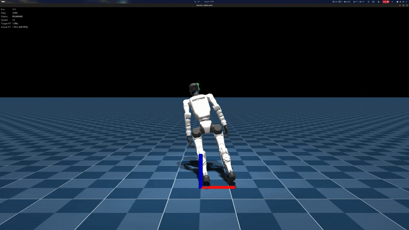
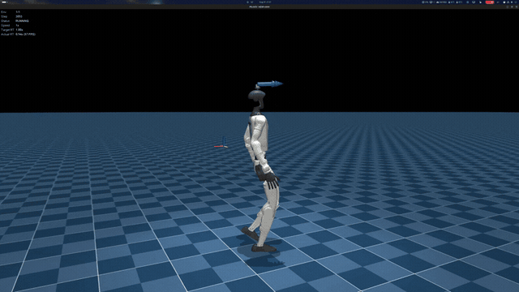

# ForesightG1

**Predictive whole-body control for Unitree G1 on dynamic, time-varying terrain.**

ForesightG1 investigates whether a humanoid can reason about how both **its body and the environment will evolve in the near future** before committing to an action.

The long-term goal is to compare reactive control against predictive control for dynamic traversal tasks involving moving platforms, unstable footholds, recovery, replanning, and eventually whole-body contact.

---

## Training Progress

<table>
<tr>
<td align="center" width="50%">

### Before Training



Zero-action G1 with no learned stabilization or locomotion.

</td>
<td align="center" width="50%">

### After Training



G1 after 10,000 PPO iterations, demonstrating stable commanded locomotion.

</td>
</tr>
</table>

---

## Current Status

### Milestone 0 — Simulation Baseline ✅

Validated the official Unitree G1 environment using GPU-accelerated MuJoCo / mjlab.

Baseline stack:

- Unitree G1 — 29 DoF
- mjlab 1.2.0
- MuJoCo 3.6.0
- MuJoCo-Warp 3.5.0
- Warp 1.12.1
- PyTorch 2.13.0 + CUDA 13.0

Simulation, observations, actions, rewards, commands, termination logic, and GPU physics were successfully validated.

---

### Milestone 1 — PPO Training Pipeline ✅

Validated the complete reinforcement-learning pipeline for `Unitree-G1-Flat`:

```text
G1 Simulation
      ↓
Parallel Rollouts
      ↓
PPO Optimization
      ↓
Checkpoint
      ↓
Policy Reload
      ↓
G1 Inference